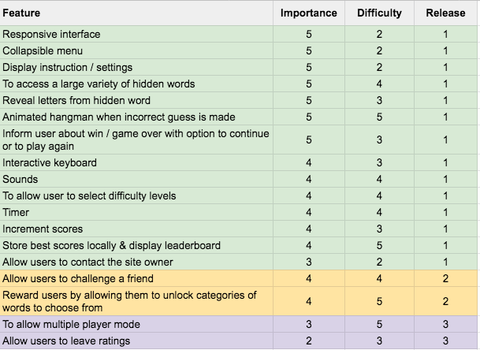
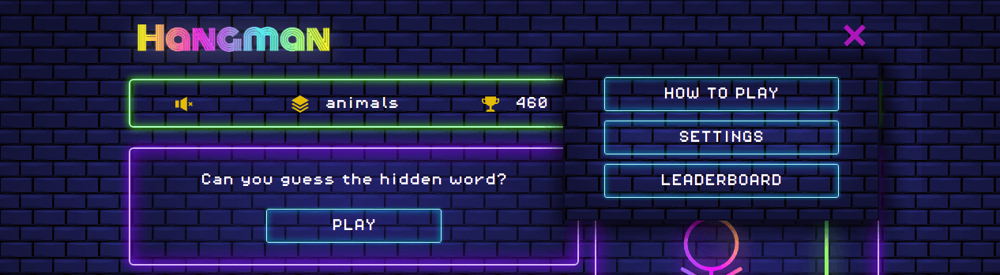
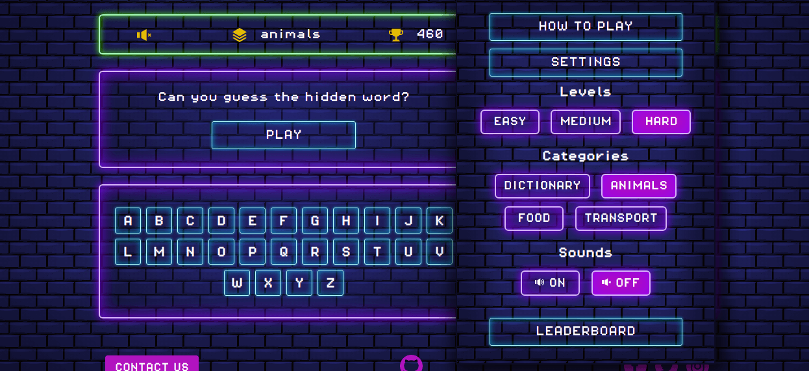
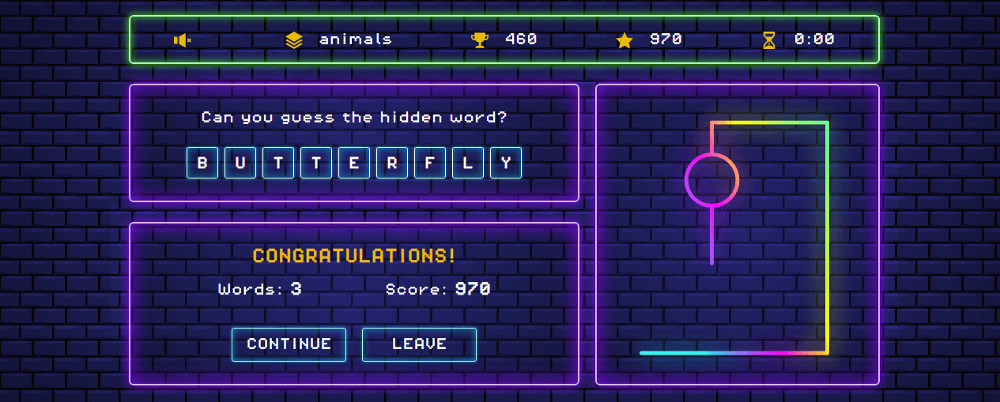

# **NEON HANGMAN**

[View live project here](https://lemocla.github.io/neon-hangman)

This website - an online version of the classic pen and paper game Hangman - was created for educational purposes only as part of the Code Institute’s full stack development course. 

Using the principles of UX design and concepts learnt during the Interactive frontend module, this fully responsive and interactive website was developed using HTML, CSS and javascript. 
 

## **TABLE OF CONTENT** 

  - [UX Design](#UX_DESIGN)
    - [Strategy](#Strategy)
    - [User stories](#User_stories)
    - [Scope](#Scope)
    - [Structure](#Structure)
    - [Skeleton](#Skeleton)
    - [Design](#Design)
  - [Features](#FEATURES)
    - [Existing features](#Existing_features)
    - [Features left to implement](#Features_left_to_implement)
  - [Technologies Used](#TECHNOLOGY_USED)
    - [Languages](#Languages)
    - [Libraries and frameworks](#Libraries_and_frameworks)
  - [Testing](#TESTING)
  - [Deployment](#DEPLOYMENT)
    - [Deployment of the page](#Deployment_of_the_page)
    - [How to run the code locally](#How_to_run_the_code_locally)
   - [Credits](#CREDITS)
     - [Code](#Code)
     - [Content](#Content)
     - [Media](#Media)
     - [Acknowledgment](#Acknowlegment)
    
# **UX DESIGN**

- ## **Strategy**

    This website is an online version of the classic word game Hangman, where the player needs to guess a word from the dictionary before time runs out, with the principal aim of providing entertainment to all ages, with the added bonus of offering some educational value to younger players. 

	- ### **For the site owner:**
        - To explore the different features of a game 
        - To create a simple, yet well designed and intuitive website 
        - To put into practice and expand on javascript, jquery libraries and API 
        - To provide an enjoyable and stimulating experience for the user of the website 
        - To encourage players to play again and new users to visit the website

    - ### **For the players:** 
        - To access the game across different devices 
        - To have a clear understanding of the rules
        - To have a fun and engaging game experience
        - To feel rewarded for and whilst playing the game 
        - To have a visually pleasing and intuitive interface 
        - To be able to play the games multiple times 
        - To contact the website owner

- ## **User stories** 

    - ### **As new player:** 
        - I want a responsive website so that I can access the game on different devices. 
        - I want to easily navigate across the site so that I can find the information I need. 
        - I want the game to upload quickly so that I can start playing as soon as possible. 
        - I want to read the instructions so that I can understand how to play.
        - I want to select a difficulty level so that I can play the game according to my abilities. 
        - I want to be able to turn the sound on and off so that I can enjoy the game according to my preferences.

    - ### **As a player playing the game:**
        - I want to see how many letters there are in the hidden word so that I can plan my guesses.
        - I want to easily click on a letter so that I can find out if it is in the hidden word.
        - I want to see the letters guessed correctly displayed on the screen so that I can find the hidden word.
        - I want to see the letters I’ve already clicked so that I don’t make incorrect guesses again.
        - I want to see the hangman parts so that I know how many attempts I’ve got left. 
        - I want to see the timer so that I know how much time I’ve got left to win the game. 
        - I want to see my score so that I feel rewarded when I am playing.
        - I want the option to exit the game so that I can leave without losing. 
        - I want the option to play again once I finish a game so that I can keep having fun and challenge myself.

    - ### **As a frequent / returning player:**
        - I want to see my leaderboard/statistics so that I can check my progress and achievements. 
        - I want to select a different level so that I can challenge myself/ play according to my ability.
        - I want to contact the company so that I can offer suggestions on how to improve the website.

- ## **Scope**

  - ### **Feature trade off**

    

    This game will be developed as a minimal viable product with room for future improvement and releases incorporating additional features.

  - ### **Functional requirements**

    - Responsive interface 
    - Collapsible menu 
    - To display instructions and settings
    - To give users ability to select from different levels of difficulty for the game 
    - To be able to turn sounds on and off 
    - To get random words according the selected level via WordsAPI
    - To get a backup word array stored locally should the API call fails 
    - To display a functional interactive keyboard 
    - To generate and display letter placeholders for the hidden word 
    - The reveal letter from hidden word when correct key is clicked 
    - To show relevant hangman part when incorrect letter is clicked 
    - To update scores according to scoring policy 
    - To inform user when new high score is reached 
    - To run a countdown timer that reset when a new game starts 
    - To identify when a game is finished & inform player of the outcome - win or lose 
    - Give the player the ability to continue playing if the game was won or play again if the game was lost
    - Contact form with mailjs API
    - Error messages if Email API fails 
    - Error messages is all backups fail for generating random word
    - Web storage API to store game information for when players return to website 
  
  - ### **Content requirements**

    - Clear and concise instruction on how to play the game
    - Background images to provide visually appealing and engaging interface 
    - Sounds to provide instant feedback when:
        - Correct / incorrect attempt is made
        - Points are scored 
        - Hangman being drawn 
    - Dynamically / animated hangman image
    - Icons for settings and interactive elements 
    - Headings  for interactive elements that cannot be represented by icons
    - Letters for keyboard

  - ### **Constraints**

    - Technical skills: The site owner is new to Javascript, Jquery and to API calls. 
    - Game design skills: The is owner has never designed an online game before.
    - Time: Implementing features using new technical skills will most certainly require a lot of time.

- ## **Structure**

  - ### **Information architecture**

    This game is built on a single webpage with dynamic content displayed according to user interaction and a modal page for the contact form. 

  - ### **Organisation of functionality and content**

    - Header: Logo and collapsible menu
    - Collapsible menu: instructions, settings and leaderboard 
    - Settings: sounds on/off and difficulty levels 
	- Footer: Contact form and links to social media 
	- Game information container: Scores, sounds and timer
	- Game area container: 
		- Play button, congratulation & game over message
        - Hidden word, interactive keyboard and Hangman

  - ### **Interaction design** 

    - Modal form for contact us page 
    - Buttons & social media icons with hovering effects 
    - Interactive keyboard with:
        - Hovering effect 
        - Actions on click 
        - Disabled once clicked
	- Collapsible menu 
	- Animated hangman

- ## **Skeleton**

    - ### **[Landing page](documentation/wireframes/landing_page.png)** 
        

    - ### **Additional wireframes:**
        - [Navigation](documentation/wireframes/navigation.png)
        - [Playing hangman](documentation/wireframes/playing_hangman.png)
        - [Game outcomes](documentation/wireframes/game_outcomes.png)
        - [Contact us](documentation/wireframes/contact_us.png)
        - [Returning users](documentation/wireframes/returning_user.png)

        Wireframes for this project are also available in pdf format and can be found [here](documentation/wireframes/hangman_wireframes.pdf). 

    - ### **Difference:**

      - **Game info:** category is displayed instead of levels
      - **Menu:** close button removed as not necessary
      - **Settings:** categories have been added in addition to levels
      - **Popup points:** not implemented
      - **Win message:** A leave button has been added as well as a line about in-game statistics
      - **Game over message:** A leave button has been added and content is laid out differently. 

- ### **Design**

  Inspired by nostalgia, the design of the game aims to recreate the spirit of 80s retro arcade era with a modern twist. 

  - #### **Imagery**

    - Bricked navy background is designed using css only 
    - Neon hangman was designed as a svg (scalable vector graphic) with filter for colour and animated using css & javascript.

  - #### **Colour scheme**

    The website uses bright colours and neon effect throughout, as well as gradients to add contrast and make elements blend more together.
    All text on the website is white, except for the logo.

    Background colour | Color palette
    ------------------ | -----------------
     | 

  - #### **Typography**

    As part of the arcade theme, the website uses:
    -  [Pixel-operator](https://www.dafont.com/pixel-operator.font) font from Dafont for text due to its pixel finish.
    -  [Monoton](https://fonts.google.com/specimen/Monoton) from Google Font for the logo as it suits neon effect perfectly.

  - #### **Icons**

    SVG icons from [iconmonstr](https://iconmonstr.com/) and [IcMoon](https://icomoon.io) are used to:
    -  Illustrate interactive elements and game information such as scoring and the timer. 
    -  Bring attention to social media accounts
    The icons by their smooth finished also add contrast and complement nicely the pixel font. 

  - #### **Styling**

    - Borders and buttons have a slightly rounded corner to add a softer and modern feeling to the website.
    - Borders, buttons and hangman are styled with a neon effect as part of the overall theme of the website.

# **FEATURES** 

- ## **Features implemented** 

   - ### **Responsive layout**
      The website will resize according to the device used for better user experience. 
      The game area should also be fully visible on most screen sizes. As the website design is seeking to emulate a mobile app, the header, game information and game area sections should be fully visible on all mobile devices. 

      > I want a responsive website so that I can access the game on different devices.
 
    - ### **Collapsible navigation and interactive design**

      The game features a collapsible menu at the top of the page with a dynamic icon, to allow users to select their preferences, view the instructions and the leaderboard. 
      
      All interactive elements, including icons and buttons, feature hovering effects and all modals include closing icons / toggle effects. 
      
      > I want to easily navigate across the site so that I can find the information I need.
 
      

      

    - ### **How to play**

      This section offers concise instructions on how to play the game. 

       > - I want to read the instructions so that I can understand how to play.

       
      
    - ### **Settings**

      In this section, users will be able to select their level and category, as well as their sound preferences.
      Only one item in each section can be selected at any one time and the selected option will be highlighted in bright pink. 
      
      The default settings on the first visit are easy for level, dictionary for category and on for sounds. 
       
       > - I want to select a difficulty level so that I can play the game according to my abilities.
       > - I want to be able to turn the sound on and off so that I can enjoy the game according to my preferences.
       
       

    - ### **Game information**
    
      The game information section features:
       - **Sounds preference:** The sound can also be turned on/off from this section and will be updated in settings.
       - **Categories:** updated dynamically when a new category is selected in settings.
       - **Best score:** displays best score achieved, regardless of being recorded or not.
       - **Score:** Incremented dynamically when a game is played and reset to 0 when a game is over.
       - **Timer:** Initially set at zero, the countdown timer will be set at 2 min when the player clicks play/continue.       

      Each element in this section is recorded in the local storage for when the user next visit & play the game.                                                                                       

      > - I want to see the timer so that I know how much time I’ve got left to win the game.
      > - I want to see my score so that I feel rewarded when I am playing.
      > - I want to see my leaderboard/statistics so that I can check my progress and achievements.

      

    - ### **Play & continue buttons**
      
      To quickly upload the game, the user can click play (or continue if a returning user with a game in progress) to display the hidden word, set the countdown timer and hide all of the hangman parts.

      > I want the game to upload quickly so that I can start playing as soon as possible.
 
      

      

    - ### **Hidden word section and hint**
      
      When a player starts a game, the hidden word will be dynamically populated according to the level and the category selected. 
      The hidden word will feature as many letter boxes as there are letters in the word. 

       > - I want to see how many letters there are in the hidden word so that I can plan my guesses.
       > - I want to see the letters guessed correctly displayed on the screen so that I can find the hidden word.  
     
      

       The hidden word is randomly generated as follows:
       - **Selected category -> dictionary:**  
         The "dictionary" category will fetch a random word from wordsApi according to the level selected. The level are set according the words' zipf frequency.
       - **Selected category -> animals, food and transport:**  
         These categories will fetch a random word from the local words list according to the level selected.
         The levels have been defined within the list. 
       
       In addition a limit on the number of characters in a word has been set according to the width of the word container, so that the words are displayed in a user friendly way at all times. 
      
       **Hint**

       This is an additional feature that gives users clues about the hidden word. The clue will toggle when the lightbulb is clicked and will be displayed by default for a few seconds before closing again, saving the users the additional task of closing the modal whilst concentrating on finding the hidden word. 
       
       For words generated via the API, hints will be generated at random from a collection of definitions for that word (as some definitions may appear quite odd). 

        

    - ### **Interactive keyboard**
 
      The game features an interactive keyboard that allows users to click on letters to guess the hidden word, prompting the letter to be revealed if correct or the relevant hangman part to be displayed if incorrect. 
      
      If the sounds preference are on, a happy sound will play if the letter is correct and a negative one if it is incorrect.

      Once clicked, the letter will be disabled until the game is finished. 
      
       > - I want to easily click on a letter so that I can find out if it is in the hidden word.
       > - I want to see the letters I’ve already clicked so that I don’t make incorrect guesses again.

       
    
    - ### **Scoring**

      The in-game scoring is incremented every time a correct letter is clicked as follows:

      - Default point is 10 points per letter
      - If a player guess more than one letter consecutively, it's a streak and the default point for that letter is mulitplied by the streak before being added to the score.

      The streak is reset to 0 when an incorrect guess is made. 
      
    - ### **Hangman**

      The game features an svg animated hangman, split in 10 different parts, each being displayed when an incorrect letter is clicked. 

       > - I want to see the hangman parts so that I know how many attempts I’ve got left.

      

    - ### **Game win**
      
        When a player has revealed all the letters in the hidden word, a win message will display together with happy music (if sound preferences are on).
        The player will be offered the option to continue or leave the game. Information will be recorded in the local storage, so that the player can leave the game without losing his score. 
        
        

        > - I want the option to exit the game so that I can leave without losing.
        > - I want the option to play again once I finish a game so that I can keep having fun and challenge myself.
      
    - ### **Game over**

        When all the hangman parts are revealed, the game over message will display (together with a sad music if sounds preferences are on) offering the player the option to play again or leave the game. 
        
        Score will be reset to 0 and if player achieves a new best score, he will be prompted to save his score by entering his name. 

        

        Game over best score | Game over best score saved
        -------------------- | -------------------
         | 

        > - I want the option to exit the game so that I can leave without losing.
        > - I want the option to play again once I finish a game so that I can keep having fun and challenge myself.

    - ### **Leaderboard**

      Once a player has entered their name to save their best score, the leaderboard will be updated with their details and the date the best score was recorded.

       > - I want to see my leaderboard/statistics so that I can check my progress and achievements.

        

    - ### **Local storage**
     
      Local storage will store and retrieve the following data for user next visit or when the page is refreshed.
       - Selected level
       - Selected categories 
       - Sound preferences 
       - Best score
       - Leaderboard 
       - Score   
       - Word count

      In addition, it will store and update data for game in progress:
       - Word 
       - Hint
       - Key pressed 
       - Matched letters
       - Incremented score 
       - Count streaks (number of correct letters found in a row)
       - Incorrect count 
       - Timer

    - ### **Footer**
 
      The footer displays a “contact us” opening a contact form in a modal window as well as social media icons with links opening onto a new tab, so that users can browse these without losing access to the website.  

      > As a frequent / returning player, I want to contact the company so that I can offer suggestions on how to improve the website.

      

      The modal contact form features a closing icon if the user decides not to contact the developer.

      

      Upon submitting the form, an email should be sent to the site owner via emailjs and the modal window should close. A modal message confirming that the message has been sent successfully should display and should the emailjs call fail, a modal message should inform the user of alternative ways to contact the site owner.  

      

- ## **Features left to implement** 

  - Add a feature to allow users to leave a review 
  - Add a database to add and manage for words and categories.  
  - Add a feature to allow users to challenge a friend with a word by email or social medias.
  - Add a multiplayer mode
  - Convert the website as a Progressive Web Application (PWA) and re-develop the game as an app for ios and android.

# **TECHNOLOGY USED**

- ## **Languages**
  - [HTML](https://developer.mozilla.org/en-US/docs/Learn/Getting_started_with_the_web/HTML_basics)
  - [CSS](https://developer.mozilla.org/en-US/docs/Web/CSS)
  - [Javascript](https://developer.mozilla.org/en-US/docs/Web/JavaScript)

- ## **Libraries, framework and other technologies** 
  - [Jquery](https://api.jquery.com/): to simplify Ajax, DOM manipulation and event handling. 
  - [Scalable Vector Graphics](https://www.w3.org/TR/SVG11/intro.html) (SVG): for the animated hangman.  
  - [JavaScript Object Notation](https://developer.mozilla.org/en-US/docs/Learn/JavaScript/Objects/JSON) (JSON): for the local word lists & array in local storage.
  - [wordsAPI](https://www.wordsapi.com/): To generate random word from dictionary category
  - [Email JS](https://www.emailjs.com/): To send email via the website
  - [Google fonts](https://fonts.google.com/): For the Hangman logo
  - [BeautifyTools](https://beautifytools.com/excel-to-json-converter.php): To convert excel word list into a json file

# **TESTING** 

- ## **Intro** 

  - Bugs and solution 
  - User stories 
  - Responsiveness and compatibility 
  - Testing performance - eg google lighthouse report
  - Testing accessibility - wave report
  - W3C HTML Code Validator
  - W3C CSS Jigsaw Validator
  - JSHint javascript 

- ## **Known bugs**

  - Animation displaying hangman parts on iphone, using Safari in portrait mode, appears a little jerky.
  - Random function may provide the same consecutive output for random words.
  - As the best score is added to the leaderboard when a player enters their name in the input field, the score may be recorded before the player finished typing their name (this would happen if a player was idling as they type their name)

# **DEPLOYMENT** 

- ## **Intro interface used to develop the website**

    This website was developed on Gitpod using the Code Institute student template with changes frequently committed to git then pushed onto GitHub from the Gitpod terminal.
    
    Several branches were created and merged onto the master when implementing new features. All branches should be updated with the latest version of the website. 
    
    The deployed version of the website is the master. 

- ## **Deployment of the page**
  
    The website was deployed on GitHub using the following steps: 
    - Log onto GitHub 
    - Go to the “repositories” section 
    - Click on the repository:  lemocla/neon-hangman
    - Once in the repository, click on ‘settings’ located in the right handside of the menu on top of the repository. 
    - Scroll down to the section “GitHub Pages”
    - Under “Source”, select “Master” in the first tab
    - In the next tab, select “/root” if not already selected by default
    - Click “Save”  and the Page will automatically refresh 
    - Scroll down again to the section “GitHub Pages” to view the url displayed in a blue banner at the top of the section. 
    - Now that the link is displayed, the website is deployed and can be accessed in the browser by clicking on the url.

     

- ## **How to run the code locally** 

    To use this project, you can either fork or clone the local repository on gitHug as follows:

  - ### **Forking local repository**

    You can make a copy of the GitHub Repository by "forking" the original repository onto your own account, where changes can be made without affecting the original repository by following the following steps: 
    - Log onto Github
    - Navigate to the GitHub repository : [lemocla/neon-hangman](https://github.com/lemocla/neon-hangman)
    - Click on the fork icon (located on top right of the page at the same level of repository name)
    - You should now have a copy of this repository into your GitHub account.
	- To make a change changes, clone the file into your local IDE.

    

    For more information on how to fork a repository, please check this [github documentation](https://docs.github.com/en/github/getting-started-with-github/fork-a-repo).

  - ### **Cloning local repository**

    - Log into GitHub and navigate to the GitHub repository: [lemocla/neon-hangman](https://github.com/lemocla/neon-hangman)
    - Above the repository folder and file content, click “Code”
    - Select from one of the following options:
        - **Clone the files using url** 
            -  Copy the url
            -  Create a repository in GitHub and a workspace in your IDE
	        -  Open the terminal and type: $ git clone https://github.com/lemocla/neon-hangman.git
            -  All the files should have been imported in your workspace
	    - **Download zip files**
            - Create a repository in GitHub and a workspace in your IDE
            - Unzip the folder
            - Upload the files into your workspace
    

    You can find all the steps to follow according to your chosen method in this [GitHub documentation](https://docs.github.com/en/github/creating-cloning-and-archiving-repositories/cloning-a-repository) on how to clone a repository.

# **CREDITS** 

- ## **Code**

    - [Brick Background Pattern Using Pure CSS](https://www.youtube.com/watch?v=o_hNQQBYpeE) youtube tutorial was used and adapted to build the background.

    - **SVG Hangman**
      - SVG circle path was adapted from the code in this [smashing magazine](https://www.smashingmagazine.com/2019/03/svg-circle-decomposition-paths/) article.
      - SVG drawing style animation followed the principles in this [codepen post](https://codepen.io/MyXoToD/post/howto-self-drawing-svg-animation).
      - The glow filter for the hangman is from this [stackoverflow post](https://stackoverflow.com/questions/54112231/is-it-possible-to-create-a-glow-effect-in-svg)
    
    - **Changing SVG icons colors**
      - Applying a filter to svg icons were inspired by this [css-Tricks](https://css-tricks.com/change-color-of-svg-on-hover) post.
    
    - **Buttons hovering effect**
      - Hovering effect on button were created using this [w3schools tutotrial](https://www.w3schools.com/howto/tryit.asp?filename=tryhow_css_buttons_fade3)

    - **Form and modals** 
      - Modals were created using this [w3schools tutotrial](https://www.w3schools.com/howto/howto_css_modals.asp)
      - Adapting jsmail api documentation to jquery for prevent submit from [w3schools](https://www.w3schools.com/jquery/tryit.asp?filename=tryjquery_event_submit_preven) 
    
    - **JSON array** 
      - Sort json array from [c-sharpcorner](https://www.c-sharpcorner.com/UploadFile/fc34aa/sort-json-object-array-based-on-a-key-attribute-in-javascrip/) post
       
      - Filter json array adapted from this [stack overflow](https://stackoverflow.com/questions/2722159/how-to-filter-object-array-based-on-attributes) post
      
    - **Timer**
      - Code to for the countdown timer is adapted from this [stackoverflow post](https://stackoverflow.com/questions/31106189/create-a-simple-10-second-countdown)
      - Code to turn seconds into 2 digit number when less than 10 is from this [stackoverflow post](https://stackoverflow.com/questions/3605214/javascript-add-leading-zeroes-to-date)
      
    
    - **Sounds**
      - Playing sound with jquery was taken from this [medium blogpost](https://medium.com/@ericschwartz7/adding-audio-to-your-app-with-jquery-fa96b99dfa97)

    - **Additional**
      - How to to create an array of definitions from api results used [jquery documentation](https://api.jquery.com/jquery.map/) 
      - Solution to target toggled elements was found in [stack overflow post](https://stackoverflow.com/questions/1616006/jquery-select-all-br-with-displaynone/15373670)
   
- ## **Content**

    The content was created by the developer. Some of the words in the transport category were taken from [Enchanted Learning](https://www.enchantedlearning.com/wordlist/transportation.shtml) vehicles and transportation word list. 

- ## **Media**

  -  ### **Images**  

     The hangman svg was coded by myself, other icons used on this website were from:  
      - [iconmonstr](https://iconmonstr.com/) for all icons in image folder, except the trophy.  
      - [icomoon](https://icomoon.io/app/#/select) for the trophy svg.  

  -  ### **Sounds**
     
     All sounds are from [mixkit](https://mixkit.co/free-sound-effects/) free online sound library.

  -  ### **Fonts**
     
     The Pixel-operator font used for the text is from [dafont](https://www.dafont.com/pixel-operator.font).

- ## **Acknowledgment** 

  - My mentor Can Sucullu for his advice and guidance during this project
  - My peers from the November What's App Group for their support and guidance
  - Code Institute tutor support for their brillant advice 
  - The Code Institute slack community for general advices and solution to problems that others encountered

   **And a special thank you to my family who helped me design some very creative hints for the local words and test the game.** 
  

