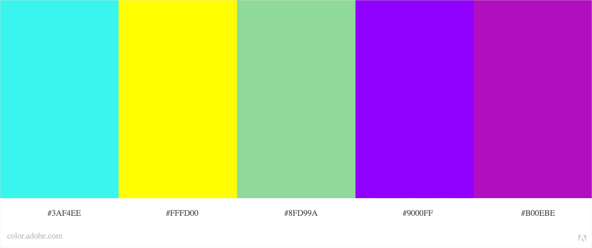

# **NEON HANGMAN**

[include screenshots of project on responsive devices]

View live project here [link to deployed link]

This website - an online version of the classic pen and paper game Hangman - was created for educational purposes only as part of the Code Institute’s full stack development course. 

Using the principles of UX design and concepts learnt during the Interactive frontend module, this fully responsive and interactive website was developed using HTML, CSS and javascript. 
 

## **TABLE OF CONTENT** 

  - [UX Design](#UX_DESIGN)
    - [Strategy](#Strategy)
    - [User stories](#User_stories)
    - [Scope](#Scope)
    - [Structure](#Structure)
    - [Skeleton](#Skeleton)
    - [Design](#Design)
  - [Features](#FEATURES)
    - [Existing features](#Existing_features)
    - [Features left to implement](#Features_left_to_implement)
  - [Technologies Used](#TECHNOLOGY_USED)
    - [Languages](#Languages)
    - [Libraries and frameworks](#Libraries_and_frameworks)
  - [Testing](#TESTING)
  - [Deployment](#DEPLOYMENT)
    - [Deployment of the page](#Deployment_of_the_page)
    - [How to run the code locally](#How_to_run_the_code_locally)
   - [Credits](#CREDITS)
     - [Code](#Code)
     - [Content](#Content)
     - [Media](#Media)
     - [Acknowledgment](#Acknowlegment)
    
# **UX DESIGN**

- ## **Strategy**

    This website is an online version of the classic word game Hangman, where the player needs to guess a word from the dictionary before time runs out, with the principal aim of providing entertainment to all ages, with the added bonus of offering some educational value to younger players. 

	- ### **For the site owner:**
        - To explore the different features of a game 
        - To create a simple, yet well designed and intuitive website 
        - To put into practice and expand on javascript, jquery libraries and API 
        - To provide an enjoyable and stimulating experience for the user of the website 
        - To encourage players to play again and new users to visit the website

    - ### **For the players:** 
        - To access the game across different devices 
        - To have a clear understanding of the rules
        - To have a fun and engaging game experience
        - To feel rewarded for and whilst playing the game 
        - To have a visually pleasing and intuitive interface 
        - To be able to play the games multiple times 
        - To contact the website owner

- ## **User stories** 

    - ### **As new player:** 
        - I want a responsive website so that I can access the game on different devices. 
        - I want to easily navigate across the site so that I can find the information I need. 
        - I want the game to upload quickly so that I can start playing as soon as possible. 
        - I want to read the instructions so that I can understand how to play.
        - I want to select a difficulity level so that I can play the game according to my abilities. 
        - I want to be able to turn the sound on and off so that I can enjoy the game according to my preferences.

    - ### **As a player playing the game:**
        - I want to see how many letters there is in the hidden word so that I can plan my guesses.
        - I want to easily click on a letter so that I can find out if is is in the hidden word.
        - I want to see the letters guessed correctly displayed on the screen so that I can find the hidden word.
        - I want to see the letters I’ve already clicked so that I don’t make incorrect guesses again.
        - I want to see the hangman parts so that I know how many attempts I’ve got left. 
        - I want to see the timer so that I know how much time I’ve got left to win the game. 
        - I want to see my score so that I feel rewarded when I am playing.
        - I want the option to exit the game so that I can leave without losing. 
        - I want the option to play again once I finish a game so that I can keep having fun and challenge myself.

    - ### **As a frequent / returning player:**
        - I want to see my leaderboard/statistics so that I can check my progress and achievements 
        - I want to select a different level so that I can challenge myself/ play according to my ability
        - I want to contact the company so that I can offer suggestions on how to improve the website

- ## **Scope**

  - ### **Feature trade off**

    

    This game will be developed as a minimal viable product with room for future improvement and releases incorporating additional features.

  - ### **Functional requirements**

    - Responsive interface 
    - Collapsible menu 
    - To display instructions and settings
    - To give users ability to select from different levels of difficulty for the game 
    - To be able to turn sounds on and off 
    - To get random words according the selected level via WordsAPI
    - To get a backup word array stored locally should the API call fails 
    - To display a functional interactive keyboard 
    - To generate and display letter placeholders for the hidden word 
    - The reveal letter from hidden word when correct key is clicked 
    - To show relevant hangman part when incorrect letter is clicked 
    - To update scores according to scoring policy 
    - To inform user when new high score is reached 
    - To run a countdown timer that reset when a new game starts 
    - To identify when a game is finished & inform player of the outcome - win or lose 
    - Give the player the ability to continue playing if the game was won or play again if the game was lost
    - Contact form with mailjs API
    - Error messages if Email API fails 
    - Error messages is all backups fail for generating random word
    - Web storage API to store game information for when players return to website 
  
  - ### **Content requirements**

    - Clear and concise instruction on how to play the game
    - Background images to provide visually appealing and engaging interface 
    - Sounds to provide instant feedback when:
        - Correct / incorrect attempt is made
        - Points are scored 
        - Hangman being drawn 
    - Dynamically / animated hangman image
    - Icons for settings and interactive elements 
    - Headings  for interactive elements that cannot be represented by icons
    - Letters for keyboard

  - ### **Constraints**

    - Technical skills: The site owner is new to Javascript, Jquery and to API calls. 
    - Game design skills: The is owner has never designed an online game before.
    - Time: Implementing features using new technical skills will most certainly require a lot of time.

- ## **Structure**

  - ### **Information architecture**

    This game is built on a single webpage with dynamic content displayed according to user interaction and a modal page for the contact form. 

  - ### **Organisation of functionality and content**

    - Header: Logo and collapsible menu
    - Collapsible menu: instructions, settings and leaderboard 
    - Settings: sounds on/off and difficulty levels 
	- Footer: Contact form and links to social media 
	- Game information container: Scores, sounds and timer
	- Game area container: 
		- Play button, congratulation & game over message
        - Hidden word, interactive keyboard and Hangman

  - ### **Interaction design** 

    - Modal form for contact us page 
    - Buttons & social media icons with hovering effects 
    - Interactive keyboard with:
        - Hovering effect 
        - Actions on click 
        - Disabled once clicked
	- Collapsible menu 
	- Animated hangman

- ## **Skeleton**

    - ### **[Landing page](documentation/wireframes/landing_page.png)** 
        

    - ### **Additional wireframes:**
        - [Navigation](documentation/wireframes/navigation.png)
        - [Playing hangman](documentation/wireframes/playing_hangman.png)
        - [Game outcomes](documentation/wireframes/game_outcomes.png)
        - [Contact us](documentation/wireframes/contact_us.png)
        - [Returning users](documentation/wireframes/returning_user.png)

        Wireframes for this project are also available in pdf format and can be found [here](documentation/wireframes/hangman_wireframes.pdf). 

- ### **Design**

  Inspired by nostalgia, the design of the game aims to recreate the spirit of 80s retro arcade era with a modern twist. 

  - #### **Imagery**

    - Bricked navy background is designed using css only 
    - Neon hangman was designed as a svg (scalable vector graphic) with filter for colour and animated using css & javascript.

  - #### **Colour scheme**

    The website uses bright colours and neon effect throughout, as well as gradients to add contrast and make elements blend more together.
    All text on the website is white, except for the logo.

    Background colour | Color palette
    ------------------ | -----------------
     | 

  - #### **Typography**

    As part of the arcade theme, the website uses:
    -  [Pixel-operator](https://www.dafont.com/pixel-operator.font) font from Dafont for text due to its pixel finish
    -  [Monoton](https://fonts.google.com/specimen/Monoton) from Google Font for the logo as it suits neon effect perfectly

  - #### **Icons**

    Icons from Font Awesome Library are used to:
    -  Illustrate interactive elements and game information such as scoring and the timer. 
    -  Bring attention to social media accounts
    The icons by their smooth finished also add contrast and complement nicely the pixel font. 

  - #### **Styling**

    - Borders and buttons have a slightly rounded corner to add a softer and modern feeling to the website.
    - Borders, buttons and hangman are styled with a neon effect as part of the overall theme of the website.

# **FEATURES** 

- ## **Existing features** 

  Ex: responsive website, navigation, footer, page x,y,x, form, call for action, map, carousel ...

    - **Feature 1 (ex format)**
       > Allows user x to achieve y by having to fill out y
       > Link feature to relevant user story 

      [you can add screenshots to this section]

- ## **Features left to implement** 

# **TECHNOLOGY USED**

- ## **Languages**
  Eg: HTML, CSS 

- ## **Libraries and frameworks** 
  Eg: Bootstrap, jquery

  Include links and a short sentence about what the library was used for

# **TESTING** 

- ### **Intro** 

  - Bugs and solution 
  - User stories 
  - Responsiveness and compatibility 
  - Testing performance - eg google lighthouse report
  - Testing accessibility - wave report
  - W3C HTML Code Validator
  - W3C CSS Jigsaw Validator
  - Jslint or other javascript validators

- ### **Known bugs**

# **DEPLOYMENT** 

- ### **Intro interface used to develop the website**

- ### **Deployment of the page**
  (Write step & take screenshot of steps undertaken to deploy the page)

- ### **How to run the code locally** 
  - #### **Forking local repository**
  - #### **Cloning local repository**

## **CREDITS** 

- ### **Code**
- ### **Content**
- ### **Media**
- ### **Acknowledgment** 

  [Include specific links to the source]

