# **TESTING USER STORIES** 

  - ### **Introduction**: 

    Testings of user stories are  set on the user’s journey across the website and cover all interactive elements, as well as the responsiveness of the website across different devices and browsers.
    User stories were tested manually.

     [Click here](../../README.md#TESTING) to go back to the main section of the ReadMe. 
     
  - ### **As new player, I want a responsive website so that I can access the game on different devices.**

    - #### **T01 Acceptance criteria**
        - When I visit the website using my device, all contents are visible and,
        - On mobiles or tablets, the game area is visible at all time and,
        - On mobiles or tablets in portrait mode, game elements are rearranged vertically and the game area is visible without scrolling.

    - #### **T01 Result:** PASS

        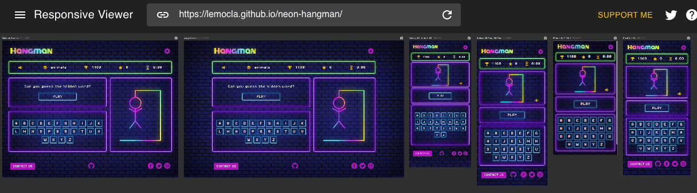

  - ### **As new player, I want to easily navigate across the site so that I can find the information I need.**

    - #### **T02 Acceptance criteria**
        - When I hover on the toggle button, its appearance changes slightly and, 
        - When I click on the toggle button, the toggle image changes to a cross and the vertical menu is displayed and,
        - When I click on one of the menu items, its content is displayed whilst other menu items' contents collapse back and,
        - When I click on the toggle button again, the menu collapses back as well as all its inner content. 

    - #### **T02 Result:** PASS  
   
      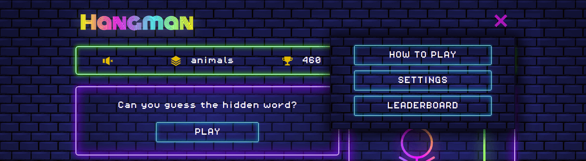

 - ### **As new player, I want the game to upload quickly so that I can start playing as soon as possible.**

    - #### **T03 Acceptance criteria**
        - When I hover over the "play" button, its appreance darkens and, 
        - When I click on the "play" button, the hidden word is displayed and the hangman parts are hidden. 

    - #### **T03 Result:** PASS  

        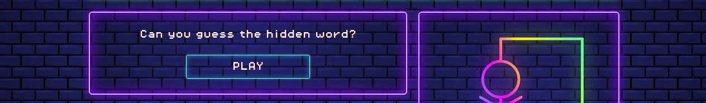

        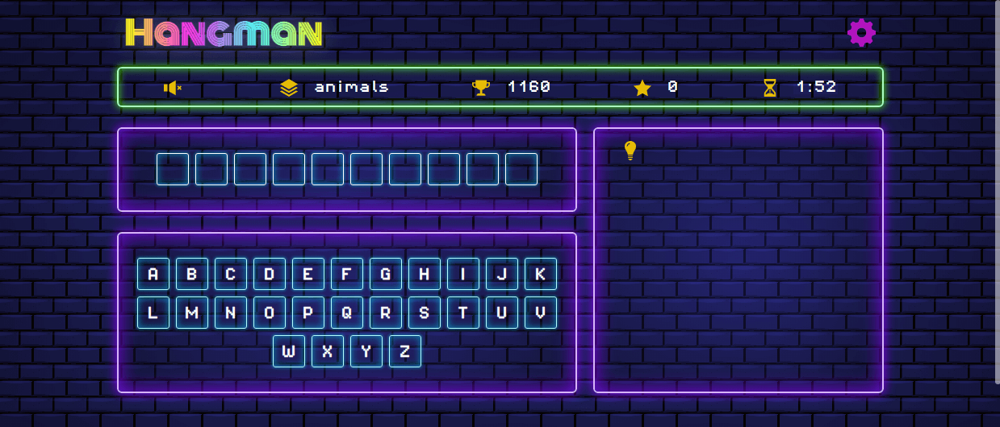

  - ### **As new player, I want to read the instructions so that I can understand how to play.** 

    - #### **T04 Acceptance criteria**
        - See T02 Acceptance criteria and, 
        - When I hover over the "how to play" button, its appearance darkens slightly and,
        - When I click on the "how to play" button, the instructions on how to play the game are displayed clearly and,
        - When I click on the "how to play" button" again, the instructions content collapses back.

    - #### **T04 Result:** PASS
   
        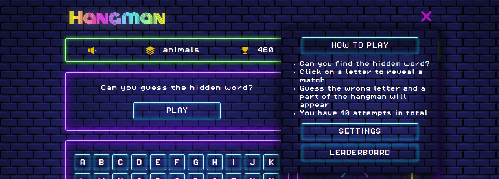

  - ### **As new player, I want to select a difficulty level and category so that I can play the game according to my abilities.**
  - ### **As new player, I want to be able to turn the sound on and off so that I can enjoy the game according to my preferences.** 
  - ### **As a frequent / returning player, I want to select a different level so that I can challenge myself/ play according to my ability.**

    - #### **T05 Acceptance criteria**
        - See T02 Acceptance criteria and, 
        - When I hover over the "Settings" button, its appearance darkens slightly and, 
        - When I click over the "Settings" button, level, category and sounds section are displayed clearly and,
        - If I am a first time visitor, the default settings for levels, categories and sounds are set respectively to easy, dictionary and on - and,
        - When I hover on one the buttons in settings, their appearance changes to pink and,
        - When I click on any item in each section, 
            - the selected option will be highlighted in bright pink and,
            - others will be reset to their default styles and,
            - the game information section of the game will be updated with my preferences and,
        - When I click on "settings" again, the instructions content collapses back.
       
    - #### **T05 Result:** PASS

        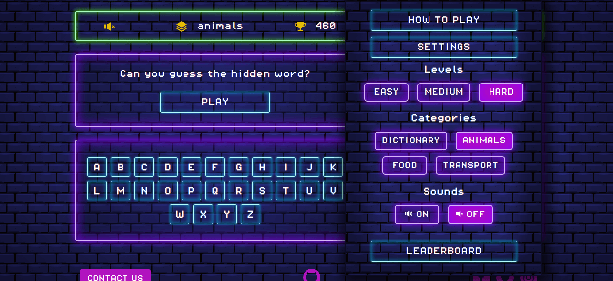

    - #### **T06 Acceptance criteria**
        - When I refresh or I return to the page, my preferences are saved. 

    - #### **T06 Result:** PASS

  - ### **As a player playing the game, I want to see how many letters there are in the hidden word so that I can plan my guesses.**

    - #### **T07 Acceptance criteria**
        - When the hidden word is displayed, I can clearly see the letter boxes that indicate how many letters there are in the hidden word. 

    - #### **T07 Result:** PASS 
   
        **Example hidden word**
        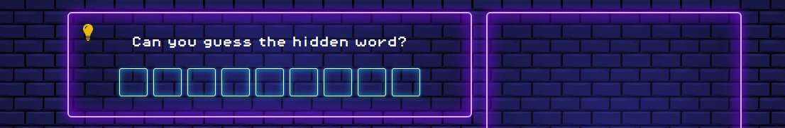

  - ### **As a player playing the game, I want to easily click on a letter so that I can find out if it is in the hidden word.** 
  - ### **As a player playing the game, I want to see the letters guessed correctly displayed on the screen so that I can find the hidden word.** 
  - ### **As a player playing the game, I want to see the letters I’ve already clicked so that I don’t make incorrect guesses again.** 
  - ### **As a player playing the game, I want to see the hangman parts so that I know how many attempts I’ve got left.**  

    - #### **T08 Acceptance criteria**
        - When I hover over one of the key on the interactive keyboard, its appearance darkens slightly and, 
        - When I click on a letter and if the guess is correct,
            - the letter is revealed in the hidden word and,   
            - if the sound preferences are on, a positive sound will play and, 
            - the key will be disabled so that I can't make that guess again and,
        - When I click on a letter and if the guess is incorrect, 
            - a part of the hangman will display and, 
            - if the the sounds preferences are on, a negative sound will play and, 
            - the key will be disabled so that I can't make this incorrect guess again. 
     
    - #### **T08 Result:** PASS
  
        **Example correct letter**
        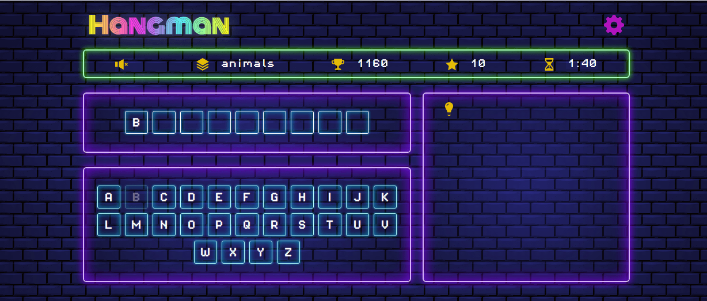

        **Example incorrect letter**
        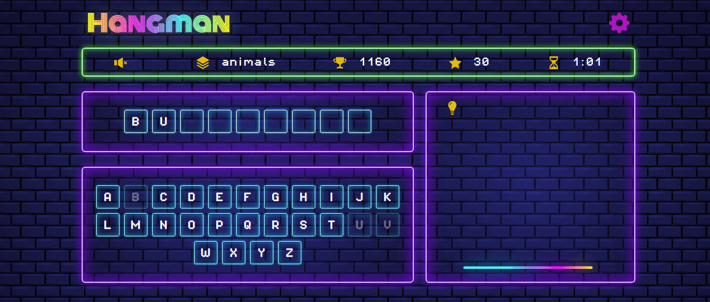

 - ### **As a player playing the game, I want to see the timer so that I know how much time I’ve got left to win the game.** 

    - #### **T09 Acceptance criteria**
        - When I start a game, I can see the timer set for 2 minutes in the game information section and, 
        - With each second passing, I can see the timer value going down and, 
        - When the timer reaches 0, the game is over. 

    - #### **T09 Result:** PASS 
      
        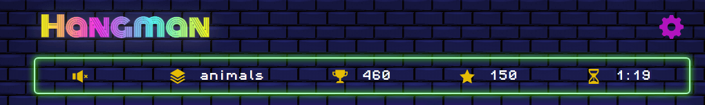

 - ### **As a player playing the game, I want to see my score so that I feel rewarded when I am playing.** 

    - #### **T10 Acceptance criteria**
        - When I press a letter and my guess is correct, I can see my score increased in the game information section.

    - #### **T10 Result:** PASS

 - ### **As a player playing the game, I want the option to exit the game so that I can leave without losing.**  

    - #### **T11 Acceptance criteria**
        - When I win a game, I can see a button to leave the game and, 
        - When I hover over the "leave" button, its appearance darkens slightly and, 
        - When I click on the the "leave" button,
            -  I am brought back to the home display and,
            -  I can see a button "continue" and,
            -  My scores are still in the game information. 

    - #### **T11 Result:** PASS
    
        

    - #### **T12 Acceptance criteria**
        - When I exit the page without finishing guessing the hidden word and I return to the game, 
            - The hidden word and my progress are retrieved and displayed and,
            - The hangman parts are retrieved and displayed and, 
            - The keys I have previously pressed are disabled and,
            - My score is retrieved and displayed and,
            - The countdown timer is retrieved and displayed, 
            as when I left the game.
            
    - #### **T12 Result:** PASS
    
        **Example of a refreshed page whilst game in progress**
        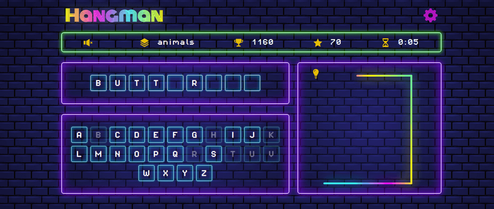

 - ### **As a player playing the game, I want the option to play again once I finish a game so that I can keep having fun and challenge myself.** 

    - #### **T13 Acceptance criteria**
        - When I win a game, a button "continue' is displayed and, 
        - When I hover over the "continue" button, its appearance darkens slightly and, 
        - When I click on the "continue" button, a new round starts.
    
    - #### **T13 Result:** PASS
   
    - #### **T14 Acceptance criteria**
        - When the game is over, a button "play gain" is displayed and, 
        - When I hover over the "play again" button, its appearance darkens slightly and, 
        - When I click on the "play again" button, a new game starts and the score is reset to 0.
    
    - #### **T14 Result:** PASS

        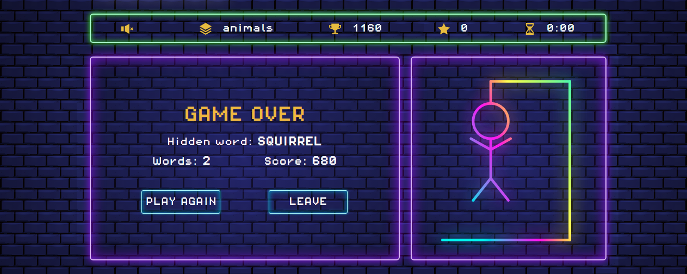

  - ### **As a frequent / returning player, I want to see my leaderboard/statistics so that I can check my progress and achievements.**   

    - #### **T15 Acceptance criteria**
        - When I look at the game information section, I can see my score and my best score.

    - #### **T15 Result:** PASS

    - #### **T16 Acceptance criteria**
        - See TC02 section and,
        - When I hover over the "leaderboard" button, its appearance darkens slightly and,
        - When I click over the "leaderboard" button, the leaderboard is displayed clearly, showing the highest scores first and,
        - When I click over the "leaderboard" button again, the leaderboard content collapses back.
     
    - #### **T16 Result:** PASS
  
        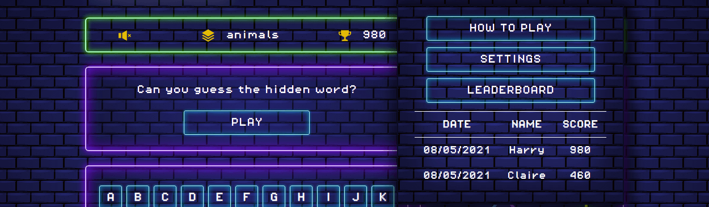

 - ### **As a frequent / returning player, I want to contact the company so that I can offer suggestions on how to improve the website.**

    - #### **T17 Acceptance criteria**
        - When I scroll to the footer at the bottom of the page, the "contact us" button and social media icons are displayed and,
        - When I hover over one of these elements, its appearance changes slightly and,
        - When I click on one of the icons, I am redirected to the right website in a new tab (ex. Facebook icon redirects to www.facebook.com.) and,
        - When I click on the "contact us" button, a modal form opens and, 
        - When I click on the cross at the top right of the page, the modal form closes. 

    - #### **T17 Result:** PASS

        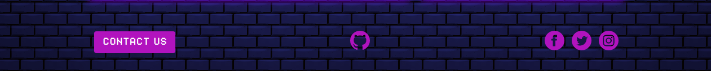

    - #### **T18 Acceptance criteria - form happy path**
        - When I enter my first name in the “first name” field and,
        - When I enter my last name in the “last name” field and,
        - When I enter a valid email address in the “email” field and,
        - When I enter a message in the “message field” and,
        - When I click submit, a modal message displays thanking me for my message and I should receive an email thanking me for my queries. 

    - #### **T18 Result:** PASS

        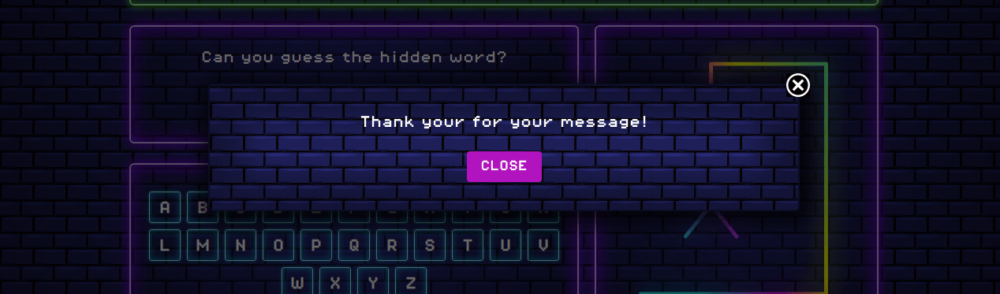

    - #### **T19 Acceptance criteria - form unhappy path**
        - When I enter an invalid email address and when I click submit, a message prompts me to enter a valid email address and/or,
        - When I leave the “first name” field empty and/or,
        - When I leave the “last name” field empty and/or,
        - When I leave the “email” field empty and/or,
        - When I leave the “message” field empty and/or,
        - When I click submit, a message will appear to prompt me to enter the required fields

    - #### **T19 Result:** PASS

        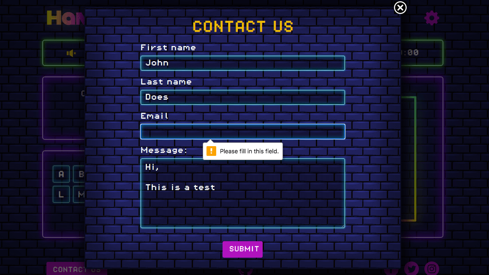

